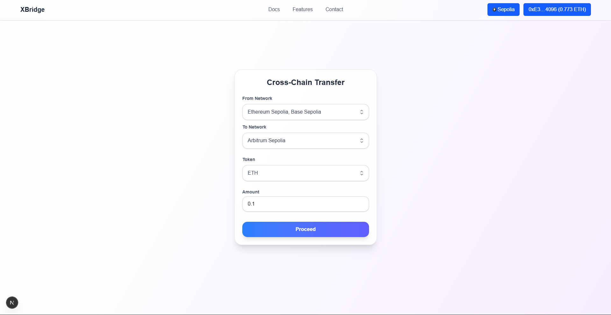

# XBridge

**XBridge** is a lightweight, user-friendly cross-chain token transfer interface built with Next.js. It leverages the **Avail Nexus SDK** to seamlessly move tokens from multiple networks into a single target network in just a few clicks.


## Table of Contents

- [XBridge](#xbridge)
  - [Table of Contents](#table-of-contents)
  - [Demo](#demo)
  - [Features](#features)
  - [Tech Stack](#tech-stack)
  - [Installation](#installation)
  - [Usage](#usage)
  - [License](#license)


## Demo

<p align="center">
  
</p>

## Features

- Select multiple source networks from which to transfer tokens.  
- Choose a token and the target network.  
- Simple and intuitive interface for multi-chain transfers.  
- Quick execution: user confirms transactions and tokens arrive in the target network within seconds.  
- Built for portfolio demonstration and developer-friendly experimentation.

## Tech Stack

- **Frontend Framework:** Next.js  
- **Wallet Integration:** Wagmi, RainbowKit  
- **Blockchain SDK:** Avail Nexus SDK  
- **Styling:** Tailwind CSS  
- **Icons:** Heroicons  

## Installation

Clone the repository and install dependencies:

```bash
git clone https://github.com/WhatFate/cross-chain-app
cd cross-chain-app/frontend
npm install
npm run dev
```

Open [http://localhost:3000](http://localhost:3000) in your browser.

## Usage

1. Connect your wallet using RainbowKit.
2. Select the source networks containing your tokens.
3. Choose the token and the target network.
4. Enter the amount to transfer.
5. Click **Proceed** and confirm the prompted transactions.
6. Tokens will be transferred to the selected network within seconds.

## License

[](LICENSE)
